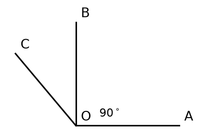
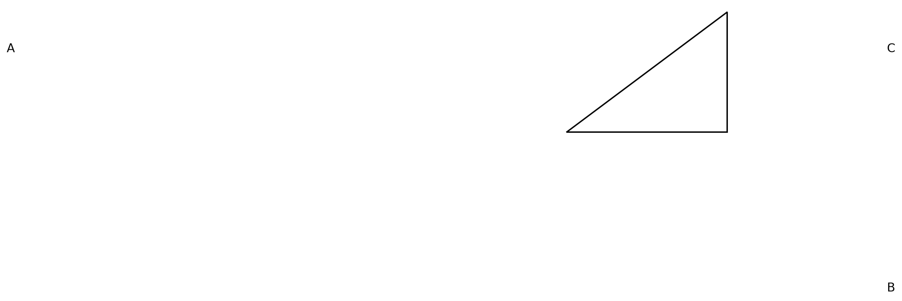

# 七年级（上）数学·期中测试卷

| 学校：__________ | 班级：__________ | 姓名：__________ | 学号：__________ | 成绩：__________ |
| --- | --- | --- | --- | --- |

**注意事项：**

1. 本卷共三大题，满分 100 分，考试时间 90 分钟。
2. 答题前请先将学校、班级、姓名、学号填写清楚。

## 一、选择题（每小题 3 分，共 30 分）

1. 下列各数中，最小的是（　　）

   A. $-3$　B. $0$　C. $1$　D. $2$

2. 如图，已知 $\angle AOB = 90^\circ$，则 $\angle BOC$ 的度数为（　　）

   

   A. $30^\circ$　B. $40^\circ$　C. $50^\circ$　D. $60^\circ$

3. 计算 $(-2)^3$ 的结果是（　　）

   A. $-8$　B. $8$　C. $-6$　D. $6$

## 二、填空题（每小题 3 分，共 15 分）

1. 绝对值最小的有理数是 ________。

2. 若 $x=2$ 是方程 $3x - a = 4$ 的解，则 $a = $ ________。

3. 比较大小：$-\frac{3}{4}$ ________ $-\frac{2}{3}$（填"$>$"或"$<$"）。

## 三、解答题（共 55 分）

1.（8 分）计算：$2^3 \times \left(-\frac{1}{2}\right) + \sqrt{16}$。

   解：原式 $= 8 \times \left(-\frac{1}{2}\right) + 4 = -4 + 4 = 0$

2.（10 分）解方程：$2x - 3 = 7$。

   解：

   $$ 2x = 7 + 3 $$

   $$ x = \frac{10}{2} = 5 $$

3.（12 分）如图，$\triangle ABC$ 中，$AB=4$，$BC=3$，$\angle B = 90^\circ$，求 $AC$ 的长。

   

   解：由勾股定理得

   $$ AC = \sqrt{AB^2 + BC^2} = \sqrt{4^2 + 3^2} = \sqrt{25} = 5 $$

## 参考答案与评分标准

1.（8 分）原式 $= -4 + 4$（每步 4 分） $= 0$。

2.（10 分）$2x=10$（4 分）$x=5$（6 分）。

3.（12 分）由勾股定理（6 分）得 $AC=5$（6 分）。
